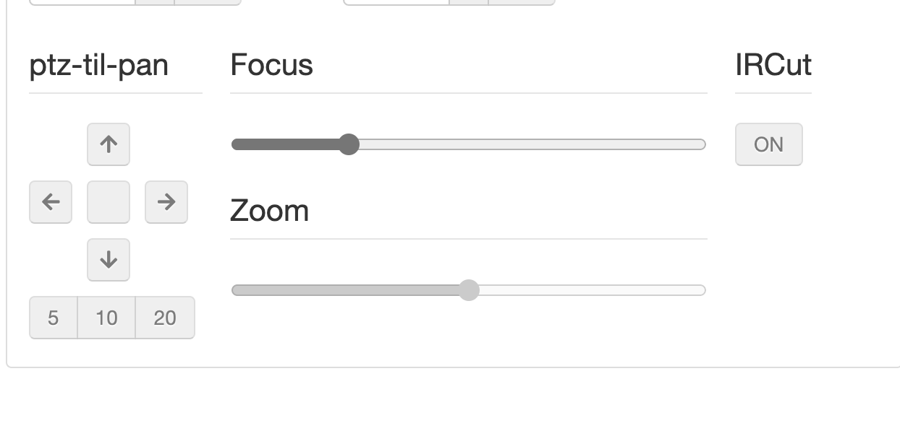

# ArducamCameraControl  

A plugin to control your arducam camera with motorized and ptz camera on octoprint.  

## Install  
Please follow the manufacturer's instructions:
#### I2C 
This plugin uses I2C to communicate with the camera.  That is not enabled by default.  The ArduCamFocus plugin will not function until
you enable I2C.
  ssh to your octopi and enter this commands (this only needs to be done once):
```bash
if ! grep -Fxq "^#ArduCamFocus$" /boot/config.txt; then
sudo cat << end_of_file > /boot/config.txt
#ArduCamFocus
dtparam=i2c_vc=on
dtparam=i2c_arm=on
end_of_file
fi
```
After executing the above command, the file /boot/config.txt should now have the commands to enable I2C.  In addition, you have to enable the I2C
kernel module using raspi-config.  Again, ssh to your octopi, and then enter this command:
```bash
sudo raspi-config
```

1. select "5 Interfacing Options"
2. select "P5 I2C"
3. raspi-config will ask, "Would you like the ARM I2C interface to be enabled?"
4. select "Yes"
5. you should see, "The ARM I2C interface is enabled"
6. select "Finish"

#### Smbus
Install smbus
```shell  
pip install smbus
```


#### Plugin  
Install plugin
http://plugins.octoprint.org/plugin/ArducamCameraControl/

After you reboot, the camera should become operational in OctoPrint
## Settings

This plugin has no configurable settings.


 

